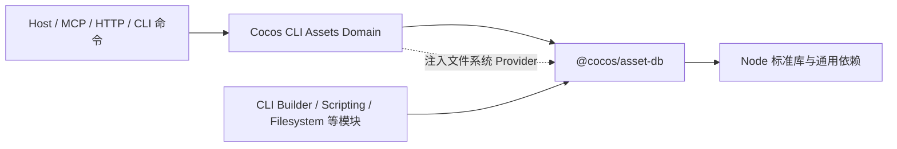
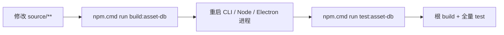

# `@cocos/asset-db` 模块说明

`@cocos/asset-db` 是 Cocos CLI 内部使用的无界面资源数据库运行时。它负责把磁盘上的资源、`.meta`、UUID、依赖和导入结果组织成可查询、可刷新的资源索引，为 CLI 的资源管理、脚本系统和构建流程提供底层能力。

当前包版本为 `3.0.0-alpha.10`，位于 Cocos CLI monorepo 的 `packages/asset-db`，通过 npm workspace 管理。它是私有包，不再单独发布到 npm。

## 一句话结论

- 修改 AssetDB 源码后，运行 `npm.cmd run build:asset-db` 或根 `npm.cmd run build` 即可生效，不需要重新发布或安装 npm 包。
- workspace 依靠 npm 创建本地链接，不是 `tsconfig paths`。
- CLI 只能通过 `@cocos/asset-db` 根入口引用本模块，禁止引用 `source` 或 `libs/*` 深层路径。
- AssetDB 跟随 CLI 一起构建、测试和 release；没有独立 tarball、npm publish 或 release 流程。

## 模块作用

AssetDB 的主要能力包括：

- 扫描资源目录，维护磁盘路径、AssetDB URL、UUID 与资源对象之间的索引。
- 读取、生成和更新资源 `.meta` 数据。
- 注册并执行 importer，处理资源导入、重导入、刷新和删除。
- 维护资源依赖、关联文件、缓存数据和变更事件。
- 提供 `Asset`、`VirtualAsset`、`AssetDB` 等底层对象。
- 提供查询、刷新和文件系统 Provider 接口。
- 允许 CLI 注入文件写入、复制、移动、重命名和删除能力，使底层操作服从 CLI 的文件系统策略。

AssetDB 是底层资源核心，不等同于 Cocos CLI 对外暴露的 Assets API。参数兼容、错误码、MCP/HTTP 接口、产品策略和跨模块编排仍由 CLI 的 Assets Domain 负责。

## 职责边界

### AssetDB 负责

| 范围 | 责任 |
|---|---|
| 资源身份 | 路径、URL、UUID、`.meta` 和资源对象索引 |
| 导入生命周期 | importer 注册、扫描、刷新、重导入、删除和事件 |
| 依赖数据 | UUID/路径依赖、关联文件和缓存持久化 |
| 底层文件能力 | 定义文件系统 Provider 接口并调用注入实现 |
| 公共包入口 | 为 CLI 提供稳定的 `@cocos/asset-db` 根入口 |

### AssetDB 不负责

- CLI 命令、HTTP、MCP、RPC 或 UI。
- VS Code、Electron、PinK 或 Creator Host 集成。
- Cocos Engine 的运行时初始化和编辑器全局状态。
- CLI 项目配置、日志体系、transport、鉴权和业务错误码。
- CLI 各领域之间的编排，例如资源保存后触发脚本、场景或构建更新。
- 对旧 AssetDB 仓库做双向同步或继续公开发布 npm 包。

如果一个需求必须读取 CLI singleton、项目管理器、transport、UI 或 Host 状态，该逻辑应放在 CLI 适配层，不应进入本包。

## 引用方向



依赖只能由上层指向下层：

```text
Host / API / MCP
        ↓
Cocos CLI 各业务模块（Assets Domain 为主要适配层）
        ↓
@cocos/asset-db
        ↓
Node 标准库、fs-extra、fast-glob 等通用依赖
```

禁止出现以下反向依赖：

```text
@cocos/asset-db → Cocos CLI src/**
@cocos/asset-db → cc / Cocos Engine
@cocos/asset-db → VS Code / Electron / PinK / Creator Host
```

## 引用规范

CLI 代码统一从包根入口引用：

```ts
import {
    Asset,
    AssetActionEnum,
    AssetDB,
    queryPath,
    type IAssetFileSystemProvider,
} from '@cocos/asset-db';
```

不要使用深层入口或源码相对路径：

```ts
// 禁止
import { Asset } from '@cocos/asset-db/libs/asset';
import { queryPath } from '@cocos/asset-db/libs/manager';
import { AssetDB } from '../../packages/asset-db/source/libs/asset-db';
```

如果 CLI 需要的新符号尚未从根入口导出，应在 `source/index.ts` 增加明确导出，并补充根入口测试。不要用深层导入绕过包边界。

## 目录结构

| 路径 | 说明 | 是否提交 Git |
|---|---|---|
| `source/` | TypeScript 生产源码 | 是 |
| `source/index.ts` | 包公共根入口 | 是 |
| `test/` | AssetDB 自有测试 | 是 |
| `scripts/test.js` | 按 spec 隔离进程的测试入口 | 是 |
| `tsconfig.json` | 包独立的 TypeScript 构建配置 | 是 |
| `package.json` | 私有 workspace 包定义 | 是 |
| `dist/` | CommonJS、声明文件等构建产物 | 否，构建生成 |
| `node_modules/` | workspace 安装的依赖 | 否，安装生成 |

本包保持独立 TypeScript 配置，当前输出目标为 ES2018/CommonJS，并生成 `.d.ts`。CLI 根构建负责串联执行，但不会把 AssetDB 编译进 CLI 的 `dist/index.js`。

## Workspace 的工作方式

根 `package.json` 显式声明：

```json
{
  "workspaces": ["packages/asset-db"],
  "dependencies": {
    "@cocos/asset-db": "3.0.0-alpha.10"
  }
}
```

运行根目录的 `npm install` 或 `npm ci` 后，npm 会建立：

```text
node_modules/@cocos/asset-db → packages/asset-db
```

Windows 上通常表现为 junction，macOS/Linux 上通常表现为符号链接。Node 仍按普通包解析 `package.json` 中的 `main` 和 `types`：

```text
main  → packages/asset-db/dist/index.js
types → packages/asset-db/dist/index.d.ts
```

这不是 `tsconfig paths`。TypeScript 和 Node 都通过真实的 workspace 包入口解析，因此运行时也必须存在 `dist`。

版本约束必须保持一致：如果将来明确决定修改包版本，需同时更新包版本、根依赖和根 `package-lock.json`。本包内不得新增独立 lockfile。

## 如何构建

所有命令建议在 Cocos CLI 仓库根目录执行。

只构建 AssetDB：

```powershell
npm.cmd run build:asset-db
```

等价的 workspace 命令：

```powershell
npm.cmd run build --workspace @cocos/asset-db
```

构建 AssetDB 和整个 CLI：

```powershell
npm.cmd run build
```

根构建顺序固定为：

```text
packages/asset-db/source
        ↓ TypeScript
packages/asset-db/dist
        ↓ 根入口供 CLI 解析
Cocos CLI build
```

`dist` 会在每次 AssetDB 构建前删除并重新生成。不要手工编辑或提交 `dist`。

根 `npm.cmd run build:watch` 目前只监听 CLI 自身的 TypeScript，不监听本包。使用 watch 模式开发时，修改 AssetDB 后仍需另开终端执行 `npm.cmd run build:asset-db`，然后重启使用它的长驻进程。

## 开发期间修改 AssetDB 后如何更新

推荐流程：



1. 修改 `packages/asset-db/source/**`。
2. 运行 `npm.cmd run build:asset-db` 生成新的 `packages/asset-db/dist`。
3. 重启正在运行的 CLI、Node 或 Electron 进程，避免继续使用 Node `require` 缓存中的旧模块。
4. 运行 AssetDB 自有测试。
5. 如果改动影响 CLI 调用或类型，再运行根构建和全量测试。

日常修改源码后不需要运行 `npm install`。安装命令只负责依赖、lockfile 和 workspace 链接；真正让源码变化进入运行时的是构建。

包级测试会先自动构建，因此以下命令也能让最新源码进入测试：

```powershell
npm.cmd run test:asset-db
```

如果只改了测试文件而没有改生产源码，仍建议使用同一命令，保证测试始终针对最新 `dist`。

### 运行时实例与进程缓存

本包在同一 Node 进程中通过 `global.AssetDB` 复用模块实例，并在内部按数据库名称维护实例表。因此：

- 不要在同一进程中混装或加载两个 AssetDB 版本；检测到版本不一致时会打印警告，并继续复用已加载的版本。
- 重新构建只会替换磁盘文件，不会清除 Node 的模块缓存或已有 AssetDB 实例；长驻进程必须重启。
- 测试应清理自己创建的数据库、临时目录和文件系统 Provider，避免状态污染后续用例。

### 新增或修改依赖

必须从仓库根目录使用 workspace 参数，让根 lockfile 成为唯一锁文件：

```powershell
# 生产依赖
npm.cmd install <package> --workspace @cocos/asset-db

# 开发依赖
npm.cmd install -D <package> --workspace @cocos/asset-db
```

完成后检查 `packages/asset-db/package.json` 和根 `package-lock.json`。不要在本包内创建 `package-lock.json`、`.npmrc` 或发布 token 配置。

## 如何测试

AssetDB 自有测试：

```powershell
npm.cmd run test:asset-db
```

测试脚本会先构建包，再将各个 `*.spec.js` 放入独立进程执行，避免旧测试中的全局单例互相污染。

迁移基线保留了 alpha.10 已确认的四个 pending 断言：两个 UUID 索引断言和两个旧 InfoManager 迁移数据断言。不要在无关改动中直接取消 pending；相应行为修复应使用独立 PR。

提交前按仓库要求执行：

```powershell
npm.cmd run build
npm.cmd run test:asset-db
npm.cmd run test -- --runInBand
```

根构建可能更新 CLI 的 DTS/API snapshot。若变化确实由公共类型入口调整引起，应一并检查并提交对应的非文档 snapshot。

## 如何 release

AssetDB 不再独立 release，也不生成 tarball。它跟随 Cocos CLI 的 release 流程：

1. 根构建先生成 `packages/asset-db/dist`。
2. release 文件扫描只复制 `packages/asset-db/package.json` 和 `dist`，排除源码、测试、脚本、本机 `node_modules`、README、tsconfig 和认证配置。
3. release 暂存区运行生产依赖安装。此时 npm 会建立 workspace 链接，并可能在包内生成版本隔离所需的嵌套生产依赖。
4. `workflow/materialize-asset-db-workspace.js` 将 workspace 链接物化为 `node_modules/@cocos/asset-db` 下的一份物理运行包。
5. 暂存区中的 `packages/asset-db` 被删除，避免重复打包。
6. release 流程从暂存区执行 `require('@cocos/asset-db')` smoke test，并输出最终运行文件清单和字节数。
7. CLI 后续继续完成 Node/Electron rebuild、测试、签名和压缩。

最终交付结构应类似：

```text
release-root/
├─ dist/                         # Cocos CLI 构建产物
├─ node_modules/
│  └─ @cocos/
│     └─ asset-db/
│        ├─ package.json
│        ├─ dist/
│        └─ node_modules/        # 仅在版本隔离需要时存在生产依赖
└─ ...
```

最终包中不得存在：

- workspace 符号链接或 junction。
- 第二份 `packages/asset-db/dist`。
- `source`、`test`、`scripts`、README、tsconfig、`.npmrc` 或 `.gitignore`。
- mocha、chai、TypeScript、`@types/*` 等开发依赖。

## 发布与版本策略

- `private: true` 是强制边界，禁止配置 `npm publish`、`publish:npm` 或公共发布 workflow。
- Cocos CLI 使用仓库内 workspace 版本，不等待外部 npm 发版。
- 旧 AssetDB 仓库保持原状，不自动同步、不回写，也不保留其 Git 历史。
- 当前 `3.0.0-alpha.10` 是迁移基线，不应在普通功能修改中随意变更版本。
- 如果未来需要重新提供公共 npm 包，必须单独评审版本、兼容性、发布权限和维护责任。

## 修改公共 API 时

1. 优先判断能力是否真的属于 AssetDB 底层职责。
2. 在具体模块实现并从 `source/index.ts` 显式导出。
3. 为根入口补充加载和类型测试。
4. 将 CLI 内所有调用保持为 `@cocos/asset-db` 根导入。
5. 运行根构建，检查 DTS/API snapshot 是否产生合理变化。
6. 避免把 CLI 专用类型、服务对象或 Host 状态泄漏到包入口。

导出新 API 不等于对外承诺重新发布 npm；它表示 Cocos CLI monorepo 内的受控包边界发生变化。

## 常见问题

### 修改源码后应该运行 `npm install` 还是 `npm run build`？

运行构建。`npm install/npm ci` 只在依赖或 lockfile 变化、首次拉取仓库、workspace 链接缺失时使用。

### 为什么只改 `source` 后 CLI 没有变化？

CLI 运行时加载 `dist/index.js`，不会直接执行 TypeScript 源码。重新构建 AssetDB，并重启长驻进程。

### 这是通过 `tsconfig paths` 引用吗？

不是。npm workspace 在 `node_modules/@cocos/asset-db` 建立真实链接，Node 和 TypeScript 都按普通 npm 包解析。

### AssetDB 能和 CLI 一起构建吗？

可以，而且根 `npm.cmd run build` 已先构建 AssetDB，再构建 CLI。两者只是使用不同输出目录：AssetDB 输出到自己的 `dist`，CLI 输出到根 `dist`。

### 能否把 AssetDB 合并进 CLI 的 `dist/index.js`？

当前不这样做。保留独立包入口可以维持模块边界、声明文件、测试和运行时解析；release 流程会把这份独立运行包正确装入最终交付物。

### release 包会不会包含整个 `packages/asset-db`？

不会。开发源码和测试在复制阶段被过滤，workspace 目录在物化后被删除。最终只保留 `node_modules/@cocos/asset-db` 的一份运行副本及必要生产依赖。

### 可以从 `@cocos/asset-db/libs/*` 导入吗？

仓库内代码不可以。需要的符号应加入根入口。深层导入会绕过公共边界，并增加构建布局和 release 兼容风险。

## 故障排查

### `Cannot find module '@cocos/asset-db'`

在仓库根目录运行：

```powershell
npm.cmd ci
```

然后确认 `node_modules/@cocos/asset-db` 指向 `packages/asset-db`。

### 找到包但缺少 `dist/index.js`

运行：

```powershell
npm.cmd run build:asset-db
```

### 类型已更新但运行行为仍是旧的

确认生产 JS 已重新生成，并重启 CLI、测试 worker、Node 或 Electron 进程。

### release 中出现 workspace 链接、源码或两份 AssetDB

检查 `.vscodeignore`、`workflow/release.js` 和 `workflow/materialize-asset-db-workspace.js`，并运行 release workspace 物化回归测试。

## 变更检查清单

- [ ] 改动属于 AssetDB 底层职责，没有引入 CLI/Host 反向依赖。
- [ ] CLI 通过 `@cocos/asset-db` 根入口引用，没有新增深层导入。
- [ ] `dist` 由构建生成，未手工修改或提交。
- [ ] 依赖变更只更新包 `package.json` 与根 `package-lock.json`。
- [ ] 没有新增包内 lockfile、`.npmrc`、token 或公共发布脚本。
- [ ] `npm.cmd run build` 通过，相关 DTS/API snapshot 已检查。
- [ ] `npm.cmd run test:asset-db` 通过。
- [ ] `npm.cmd run test -- --runInBand` 通过。
- [ ] release 文件筛选和 workspace 物化逻辑仍能保证单份物理运行包。
